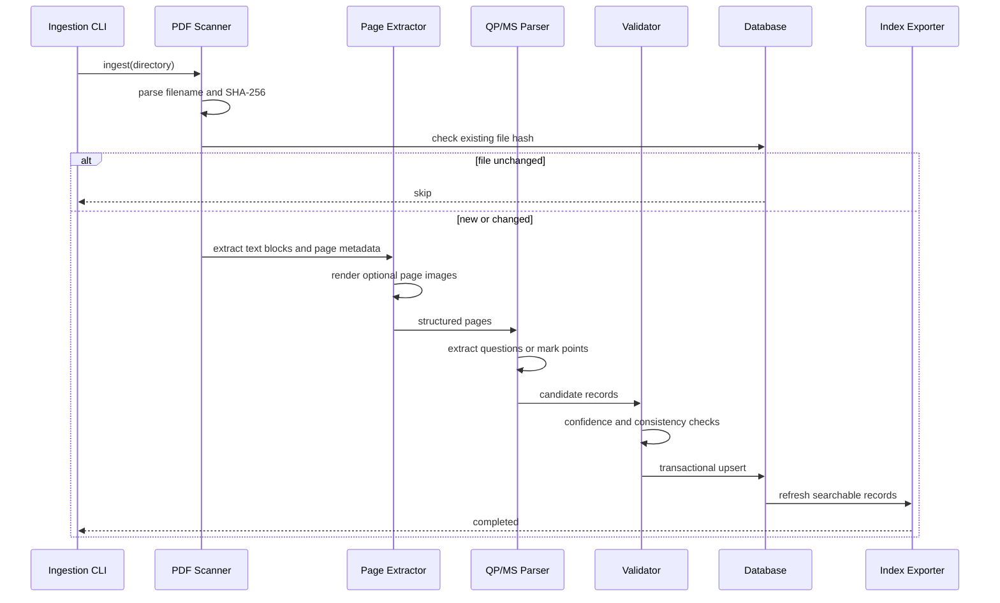

# PaperLens Past Paper Ingestion MVP

## 1. 背景

PaperLens 当前已经可以通过 `scripts/build-question-index.js` 从本地 CAIE Computer Science past paper PDF 中抽取题目文本，合并 mark scheme 内容，并生成 `generated/question-index.json` 与 `public/assets/question-index.json`。

这个 MVP 的目标不是重写现有系统，而是把现有的一次性静态索引生成脚本升级为一条可重复、可增量、可审查的数据摄取管线。最终产物仍然要能服务现有 Question Finder 和 checklist 体验，同时为后续的知识点匹配、人工审核、解析质量追踪打基础。

## 2. MVP 目标

第一版要达成以下目标：

- 从指定目录批量扫描 QP/MS/PM PDF。
- 解析文件名，识别 subject、year、session、paper number、variant、document role。
- 计算 SHA-256 文件哈希，跳过未变化文件。
- 抽取每页文本，保存页级 raw/normalized text。
- 从 QP 中抽取 question records。
- 从 MS 中抽取 mark point records，并尽量关联到 question。
- 用规则和关键词把 question 初步匹配到 syllabus knowledge point。
- 记录解析失败、低置信度、无法关联、疑似需要 OCR 等问题。
- 从数据库导出现有前端可消费的 `question-index.json`。

MVP 的核心判断标准是：管线可重复运行、失败可追踪、结果能被搜索使用。

## 3. 非目标

第一版暂不做：

- 完整 OCR 自动识别。
- 独立搜索服务或专门的 search index 基础设施。
- 完整人工审核后台 UI。
- 高精度语义匹配或 embedding ranking。
- 对所有 CAIE PDF 布局的 100% 自动解析。
- 面向公开产品直接展示大段官方题目和 mark scheme 原文。

这些能力可以在 MVP 稳定后逐步加入。

## 4. 现有基础

当前仓库已有以下能力可复用：

- `scripts/build-question-index.js`：PDF 几何文本抽取、题号区域切分、mark scheme 合并、syllabus 粗分类、JSON 索引生成。
- `prisma/schema.prisma`：PostgreSQL/Prisma 已接入，当前主要服务用户、购买、搜索历史、答题记录。
- `server.js`：已有 `loadGeneratedQuestionEntries()`、`questionSearchIndex()`、`findQuestionMatches()` 等搜索入口。
- `public/assets/paperlens-data.js`：包含 syllabus checklist、topic bank、manual question bank 等基础数据。

因此 MVP 应优先复用现有解析逻辑和导出格式，而不是另起一套完全不同的数据结构。

## 5. 数据模型

### 5.1 Paper

表示一个实际 PDF 文件。QP、MS、PM 都是独立 `Paper` 记录，通过 `paperGroupId` 关联到同一套试卷。

字段建议：

- `id`: string
- `paperGroupId`: string
- `subjectCode`: string
- `year`: int
- `session`: string
- `paperNumber`: string
- `variant`: string
- `role`: DocumentRole
- `fileHash`: string
- `sourcePath`: string
- `status`: ProcessingStatus
- `createdAt`: DateTime
- `updatedAt`: DateTime

建议枚举：

- `DocumentRole`: `QP`, `MS`, `PM`, `UNKNOWN`
- `ProcessingStatus`: `PENDING`, `PROCESSING`, `COMPLETED`, `COMPLETED_WITH_ISSUES`, `FAILED`, `SKIPPED`

### 5.2 Page

表示 PDF 中的一页。MVP 先保存页级文本和渲染图片路径；后续如果要做定位审核，再扩展 text block 坐标表。

字段建议：

- `id`: string
- `paperId`: string
- `pageNumber`: int
- `rawText`: string
- `normalizedText`: string
- `imagePath`: string?
- `width`: float?
- `height`: float?
- `requiresOcr`: bool

### 5.3 Question

表示从 QP 中抽取出的题目或子题。

字段建议：

- `id`: string
- `paperId`: string
- `questionNumber`: string
- `parentQuestionId`: string?
- `sequence`: int
- `text`: string
- `marks`: int?
- `pageStart`: int
- `pageEnd`: int
- `hasVisualContent`: bool
- `confidence`: float

说明：

- `questionNumber` 应允许 `1`, `1(a)`, `1(a)(ii)` 等完整编号。
- `sequence` 用于稳定排序。
- `confidence` 用于决定是否进入人工 review。

### 5.4 MarkPoint

表示从 MS 中抽取出的评分点、答案点或评分指导。

字段建议：

- `id`: string
- `questionId`: string?
- `paperId`: string
- `sequence`: int
- `text`: string
- `marks`: int?
- `guidance`: string?
- `sourcePage`: int
- `confidence`: float
- `kind`: MarkPointKind

建议枚举：

- `MarkPointKind`: `ANSWER`, `GUIDANCE`, `ALTERNATIVE`, `NOTE`, `UNKNOWN`

### 5.5 KnowledgePoint

表示 syllabus 中的知识点。MVP 可以先从 `public/assets/paperlens-data.js` 中导入，不一定需要人工维护 UI。

字段建议：

- `id`: string
- `syllabusCode`: string
- `syllabusVersion`: string
- `sectionCode`: string
- `title`: string
- `description`: string
- `aliases`: string[]

### 5.6 QuestionKnowledgePoint

表示题目和知识点的匹配关系。

字段建议：

- `questionId`: string
- `knowledgePointId`: string
- `matchScore`: float
- `matchMethod`: string
- `reviewStatus`: ReviewStatus

建议枚举：

- `ReviewStatus`: `AUTO_ACCEPTED`, `NEEDS_REVIEW`, `CONFIRMED`, `REJECTED`

建议唯一约束：

- `questionId + knowledgePointId`

### 5.7 ParsingIssue

记录解析过程中出现的问题。这个表是 MVP 的关键，因为 PDF 解析不会一次做到完美。

字段建议：

- `id`: string
- `paperId`: string
- `questionId`: string?
- `stage`: string
- `errorCode`: string
- `severity`: IssueSeverity
- `message`: string
- `status`: IssueStatus
- `resolvedAt`: DateTime?
- `resolvedBy`: string?

建议枚举：

- `IssueSeverity`: `INFO`, `WARNING`, `ERROR`
- `IssueStatus`: `OPEN`, `ACKNOWLEDGED`, `RESOLVED`, `IGNORED`

## 6. 摄取流程

### 6.0 当前隔离边界

当前基础框架先实现不会触碰 PDF 内容的部分：

- 扫描 PDF 目录。
- 解析 CAIE 标准文件名。
- 计算文件 SHA-256。
- 根据 subject、session、year、component 把 QP/MS/PM 归到同一个 `paperGroupId`。
- 通过 CLI 输出结构化 dry-run 报告。

实际 PDF 数据处理暂时隔离在 adapter 边界之后：

- 页面文本和几何信息抽取。
- 页面图片渲染。
- QP question region 切分。
- MS mark point 切分和 QP/MS 关联。
- OCR 判断以外的 OCR 执行。
- Prisma ingestion 表写入和兼容 JSON 导出。

这个分层对应代码：

- `src/ingestion/paperFilename.js`: 文件名解析。
- `src/ingestion/scanner.js`: 目录扫描、hash、基础 issue。
- `src/ingestion/pipeline.js`: ingestion run 报告和 PDF adapter 边界。
- `src/ingestion/pdfAdapter.js`: 当前 deferred adapter，占位实际 PDF 提取。
- `scripts/ingest-papers.js`: CLI 入口。



## 7. 解析策略

### 7.1 文件名解析

优先支持标准 CAIE 命名：

- `0478_m25_qp_12.pdf`
- `0478_s25_ms_21.pdf`
- `9618_w24_qp_42.pdf`

解析规则：

- subject code: `0478`, `9618`
- session code: `m`, `s`, `w`
- year: 两位年份，转换为完整年份
- role: `qp`, `ms`, `pm`
- component/variant: 最后两位

无法解析文件名时，创建 `ParsingIssue`，role 标记为 `UNKNOWN`。

### 7.2 页面抽取

优先复用 `pdf-parse`/PDF.js 的 text content 和坐标信息。

每页需要产出：

- 原始文本
- 规范化文本
- 页宽/页高
- 可选 page image path
- `requiresOcr` 标记

MVP 中 `requiresOcr` 只做标记，不执行 OCR。典型触发条件：

- 页面文本为空但 PDF 页面存在。
- 页面字符数明显低于预期。
- 页面包含大量不可识别字符。

### 7.3 QP 题目切分

第一版沿用现有题号 marker 策略：

- 在页边距和正文起始区域寻找主题号。
- 按题号 marker 之间的文本范围切分。
- 对疑似 pseudocode 行误识别为题号的情况做过滤。

低置信度条件：

- 题号跳跃。
- 题目文本过短。
- marks 无法识别。
- 同页出现多个冲突 marker。
- 文本中异常字符过多。

### 7.4 MS mark point 切分

优先按 mark scheme 的 question label 切分：

- `1(a)`
- `1(a)(i)`
- `2(b)`

MVP 不强求每个 mark point 都精确拆到最小评分点。可以先按 question/subquestion 聚合成若干 answer/guidance records，再逐步细化。

### 7.5 QP 与 MS 关联

关联优先级：

1. 同一 `paperGroupId`
2. 相同 subject/year/session/component/variant
3. 相同 question number 或 parent question number
4. 页码和顺序辅助判断

无法关联时：

- `MarkPoint.questionId` 可为空。
- 创建 `ParsingIssue`，例如 `MS_LINK_MISSING`。

## 8. 知识点匹配

MVP 采用规则和关键词评分，不引入 embedding。

评分信号：

- syllabus section title 命中。
- aliases 命中。
- question text token overlap。
- mark scheme text token overlap。
- 章节高权重关键词命中。
- 已有 `topicBank`/`syllabusChecklists` 中的文本命中。

建议阈值：

- `matchScore >= 0.75`: `AUTO_ACCEPTED`
- `0.45 <= matchScore < 0.75`: `NEEDS_REVIEW`
- `< 0.45`: 不写入或仅记录候选

`matchMethod` 示例：

- `keyword-v1`
- `section-title-v1`
- `manual`
- `imported`

## 9. 导出与兼容

MVP 应继续生成现有前端能读取的 JSON：

- `generated/question-index.json`
- `public/assets/question-index.json`

导出结构可以保持现有格式：

```json
{
  "generatedAt": "2026-07-10T00:00:00.000Z",
  "papers": 120,
  "questions": 1200,
  "entries": []
}
```

每个 entry 至少包含：

- `syllabusId`
- `section`
- `paper`
- `ref`
- `knowledge`
- `question`
- `answer`
- `autoIndexed`

公开产品如果涉及版权风险，导出层应支持安全模式：

- 只导出题目引用、知识点、页码、marks、source link。
- 不导出完整 QP/MS 原文。
- 内部 review/export 可以保留完整内容。

## 10. CLI 设计

建议新增命令：

```bash
npm run ingest:papers -- --dir public/textbook_syllabus/pastpaper
npm run export:question-index
```

可选参数：

- `--dir`: PDF 根目录。
- `--subject`: 限定 subject code。
- `--role`: 限定 `qp`, `ms`, `pm`。
- `--force`: 忽略 hash，全量重跑。
- `--dry-run`: 只扫描和报告，不写数据库。
- `--safe-export`: 导出不包含官方原文的 public index。

## 11. 验证标准

### 11.1 功能验收

- 同一目录重复 ingest，未变化文件会被跳过。
- 新增一个 PDF 后，只处理新增文件。
- 修改文件后，hash 改变并重新处理。
- 至少能抽取 QP 的主问题记录。
- 至少能把同 component 的 QP/MS 归到同一个 `paperGroupId`。
- 解析失败不会中断整批任务，而是写入 `ParsingIssue`。
- 导出的 `question-index.json` 能被现有 Question Finder 加载。

### 11.2 数据质量验收

建议第一版目标：

- 标准文本型 QP 主问题抽取成功率 >= 85%。
- QP/MS 文件分组成功率 >= 95%。
- 明显需要 OCR 或异常字符页面能被标记。
- 知识点 top candidate 人工抽样可接受率 >= 70%。

### 11.3 回归测试

需要增加测试：

- filename parser test
- hash skip test
- paper group id test
- question marker extraction test
- mark scheme association test
- JSON export compatibility test

## 12. 风险

### 12.1 PDF 布局差异

不同年份、不同 paper、landscape page、table、pseudocode、diagram 都会影响文本顺序。MVP 应通过 confidence 和 issue tracking 接住这些不确定性。

### 12.2 OCR 成本和准确率

OCR 不适合作为第一版默认路径。建议先标记 `requiresOcr`，统计规模后再决定是否接入 OCR。

### 12.3 知识点匹配准确率

纯关键词匹配足够支撑 MVP，但不能当作最终真值。所有匹配结果都应该保留 score、method、review status。

### 12.4 版权与公开展示

结构化存储 QP/MS 原文适合内部分析，但公开商业产品展示时需要谨慎。建议 public export 默认支持安全模式，避免大段复刻官方题目和 mark scheme。

### 12.5 数据库迁移范围

当前 Prisma schema 主要服务用户、购买和搜索历史。新增 ingestion 表时应独立成组，不要影响认证和付费流程。

## 13. 分阶段计划

### Phase 0: Schema and Parser Extraction

- 从 `build-question-index.js` 拆出 filename parser、PDF geometry parser、question region parser。
- 增加单元测试。
- 设计 Prisma ingestion models。

### Phase 1: Incremental Ingestion

- 新增 CLI。
- 实现 file hash 检查。
- upsert `Paper` 和 `Page`。
- 支持 dry run。

### Phase 2: Structured Records

- 写入 `Question`。
- 写入 `MarkPoint`。
- 建立 QP/MS paper group。
- 写入基础 `ParsingIssue`。

### Phase 3: Knowledge Matching

- 导入 `KnowledgePoint`。
- 实现 keyword/rule scoring。
- 写入 `QuestionKnowledgePoint`。
- 对低分匹配标记 `NEEDS_REVIEW`。

### Phase 4: Export Compatibility

- 从 DB 导出 `question-index.json`。
- 保持现有前端搜索逻辑兼容。
- 支持 full export 和 safe export。

### Phase 5: Review Improvements

- 增加简单 admin/review 页面。
- 支持确认、拒绝、忽略 parsing issue。
- 支持人工修正 question-knowledge mapping。

## 14. 推荐第一版任务拆分

优先实现顺序：

1. 新增 ingestion Prisma models。
2. 抽离并测试 filename parser。
3. 抽离并测试 PDF page extraction。
4. 实现 hash-based skip。
5. 实现 `Paper`/`Page` upsert。
6. 接入现有 question extraction。
7. 接入 MS extraction 和 linking。
8. 写入 `ParsingIssue`。
9. 实现 knowledge keyword matcher。
10. 从 DB 导出兼容 JSON。

这条路径可以尽快让 MVP 跑通，同时保留足够多的质量信号，方便后续一点点提高解析准确率。
